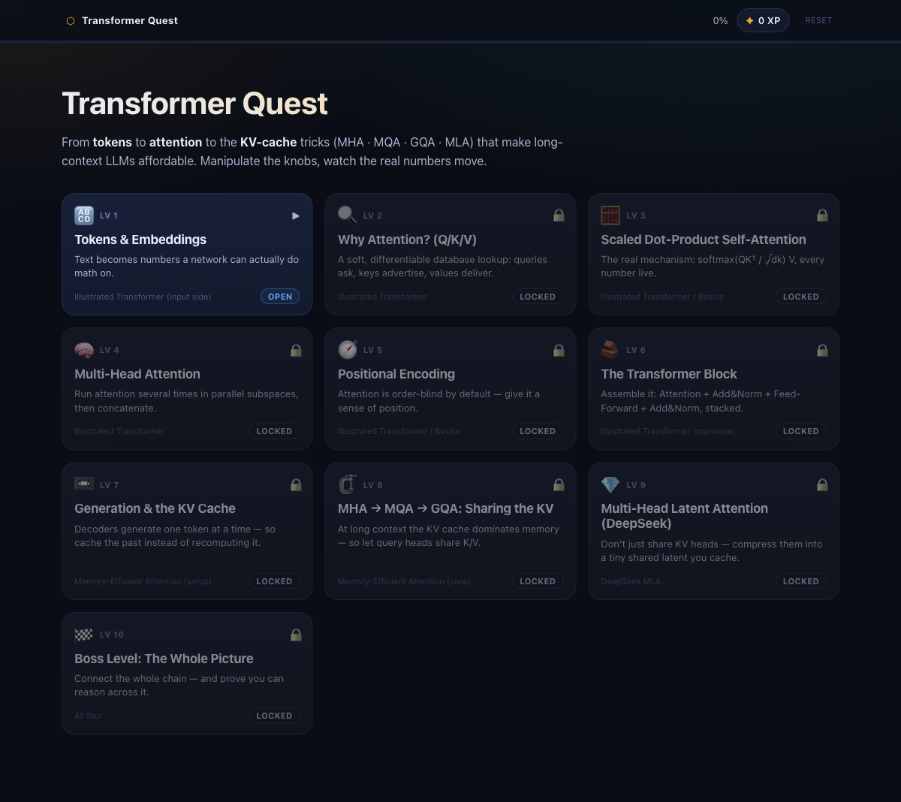
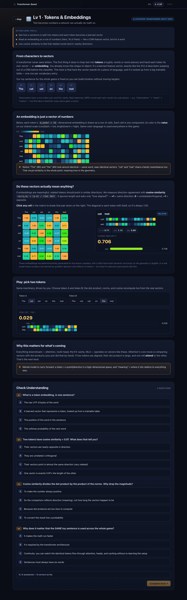
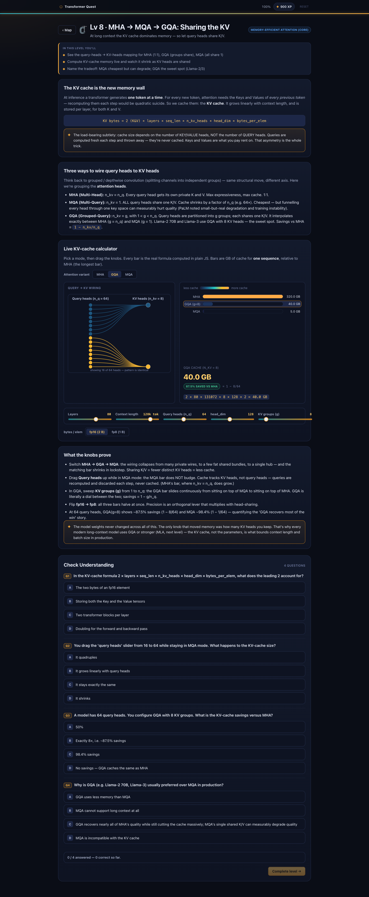
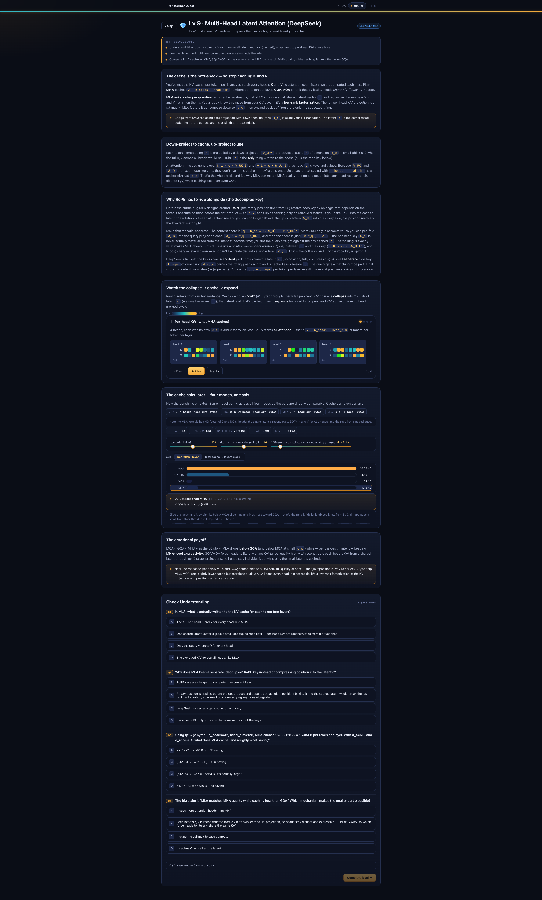

# 🧠 Transformer Quest

An interactive, **visual** browser game that takes you from **tokens → attention → multi-head → positional encoding → the transformer block → KV cache → MHA/MQA/GQA → MLA → MoE → MoH**. Drag the knobs, watch *real, deterministically-computed* numbers move, and actually *feel* how modern LLMs work under the hood.

No fake numbers. Every attention weight, dot product, softmax, cosine similarity, and KV-cache memory figure is computed live from the math — not hardcoded.

> Built for someone with a classic CNN / computer-vision background who wants to understand the LLM era from first principles. It skips the basics you already know (backprop, gradients, activations) and anchors new ideas to ones you have (residuals ↔ skip connections).



---

## ▶️ Run it

It's a **single self-contained HTML file** — vanilla JS, zero dependencies, zero network calls.

```bash
# just open it
open index.html            # macOS
xdg-open index.html        # Linux
# or double-click index.html in your file manager
```

If your browser blocks `localStorage` on `file://` (progress won't persist), serve it instead:

```bash
python3 -m http.server 8000
# then visit http://localhost:8000/index.html
```

Progress, XP, and level unlocks are saved in `localStorage`. There's a **reset** control in the header.

---

## 🗺️ The 12 levels

Each level is a short explanation + at least one **primary interactive visualization** + a quiz that gates the next level.

| # | Level | What you manipulate |
|---|-------|---------------------|
| 1 | **Tokens & Embeddings** | A sentence → tokens → vectors; a live cosine-similarity explorer (similar words = closer vectors) |
| 2 | **Why Attention? (Q/K/V)** | The soft database-lookup intuition — query asks, keys advertise, values deliver — *before* the formula |
| 3 | **Scaled Dot-Product Self-Attention** | The attention heatmap; click a query to expand `dot → ÷√dₖ → softmax`; a slider shows *why* we scale |
| 4 | **Multi-Head Attention** | Per-head tabs, each its own real pattern, then concat + output projection |
| 5 | **Positional Encoding** | The sinusoidal heatmap; toggle PE onto a token and watch order appear |
| 6 | **The Transformer Block** | A stepper walks a token through residual + LayerNorm + FFN; covers encoder vs decoder vs decoder-only + cross-attention |
| 7 | **Generation & the KV Cache** | "Generate next token" grows the cache live — the setup for the memory wall |
| 8 | **MHA → MQA → GQA** | A query→KV head **mapping diagram** that morphs between modes + a live KV-cache memory calculator (drag layers / context / heads / dtype, watch the GB move) |
| 9 | **Multi-Head Latent Attention (MLA)** | Per-head K/V collapsing into one cached **latent**; a "cache shootout" pitting MLA against MHA/GQA/MQA |
| 10 | **Mixture of Experts (MoE)** | The dense FFN becomes a **router + N expert FFNs**; watch real top-k routing + an **active-vs-total params** calculator (capacity grows with N, compute with k) |
| 11 | **Mixture of Heads (MoH)** | MoE applied to **attention heads** — a router scores heads per token, keeps the **top-k**, and weights them; active-vs-total compute as total heads H grow |
| 12 | **Boss Level** | A recap diagram + a mixed quiz connecting every idea (now incl. MoE/MoH) |

### Maps to these reads
- **Basics of Transformers** + **The Illustrated Transformer** → Levels 1–6
- **Memory-Efficient Attention: MHA vs MQA vs GQA vs MLA** → Levels 7–8 (and 9)
- **DeepSeek's Multi-Head Latent Attention** → Level 9
- **Mixtral / DeepSeek-V3 (sparse MoE)** → Level 10
- **MoH: Multi-Head Attention as Mixture-of-Head Attention** (arXiv 2410.11842) → Level 11

---

## 📸 A few levels

**Tokens & Embeddings** — embeddings as readable colored vectors + live cosine similarity:



**MHA → MQA → GQA** — the head-sharing mapping diagram + the live KV-cache memory calculator:



**Multi-Head Latent Attention** — latent compression + the cache shootout:



---

## 🏗️ How it's built

```
index.html              # the game — everything inlined into one file (the deliverable)
build/                  # the modular sources index.html is assembled from
  kernel.js             #   TQ: deterministic math (matmul / softmax / scaled-dot attention)
                        #       + visual helpers (heatmap, vectors, sliders, tabs, stepper)
                        #       + the game engine (map, quiz gating, XP, localStorage)
  styles.css            #   dark theme + the single shared color language
  shell.html            #   HTML skeleton with inline-markers for assembly
  levels/               #   one self-contained module per level (01..12)
screenshots/            # images used in this README
```

**Design principles:**
- **Real math, always.** A shared deterministic toy example (`"The cat sat on the mat"`) flows through every attention level, so the numbers are honest and reproducible (seeded — no `Math.random`).
- **One color language.** Every heatmap, vector, and bar uses the same perceptual scale, so a "hot" cell means the same thing everywhere.
- **Self-contained.** No CDNs, no fonts, no network — it works offline forever, by double-click.

To regenerate `index.html` from `build/`, inline `styles.css`, `kernel.js`, and the `levels/*.js` files (in order) into `build/shell.html`'s markers.

---

## 🤖 Provenance

This game was built by a fleet of AI agents orchestrated with [Claude Code](https://claude.com/claude-code): an architect laid down the engine + a gold-standard reference level, then a per-level pipeline (pedagogy → implementation → QA) built the rest in parallel, followed by independent ML-accuracy, UX, and coverage reviews, and a fix-and-smoke-test loop in a real browser. The ML reviewer even re-derived the KV-cache memory numbers from scratch to verify them.

## License

MIT — do whatever you like with it.
